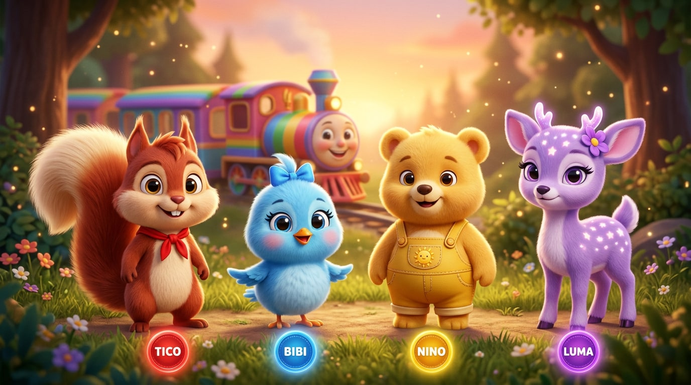

# CHARACTER CONSISTENCY / VISUAL BIBLE

## A Turminha da Floresta e o Trem das Cores

> Master style + character reference for every shot of the series.
> Reference images live in `public/assets/turminha/` and are wired into the sample
> workflow `public/workflows/turminha-da-floresta-e-o-trem-das-cores.json`
> (video model: **Seedance 2.5** via Fal.ai).

---

## 1. Global visual style

| Attribute | Value |
|---|---|
| Medium | Premium 3D CGI children's animation (Pixar-quality render) |
| Aspect / quality | 16:9, 4K, clean composition |
| Shapes | Soft, rounded, toy-like; oversized heads; big expressive eyes |
| Textures | Velvety fur / fluffy feathers, saturated candy colors |
| Lighting | Warm golden sunset key light, soft rim light, gentle bloom |
| Atmosphere | Soft magical floating light particles, bokeh, sparkle trails |
| World | Colorful enchanted forest: giant round-leaf trees, glowing mushrooms, flowers, paper garlands and lanterns at the festival |
| Audience | Preschool (2–6). Always friendly, zero scary elements |

**Style tag to prepend to every prompt:**

> Premium 3D CGI children's animation, Pixar-quality render, soft rounded toy-like
> shapes, big expressive eyes, velvety fur textures, saturated candy colors, warm
> sunset lighting, soft magical floating particles, colorful enchanted forest,
> 16:9, 4K, clean composition.

---

## 2. The four characters

### TICO — the red squirrel (VERMELHO 🔴)
- Species: squirrel boy, ~6-year-old energy, the enthusiastic leader
- Fur: warm cinnamon-red; cream belly and muzzle; HUGE fluffy tail with cream tip
- Face: big hazel eyes, two tiny buck teeth, cheerful grin
- Wardrobe: bright RED neckerchief (his only clothing item — never changes)
- Signature color: **RED** — his color medallion/plate glows red
- Personality: excited, first to spot things, shouts "Olha, olha!"
- Reference: `public/assets/turminha/tico.jpg`

### BIBI — the blue bird (AZUL 🔵)
- Species: round bluebird chick girl, small and bouncy
- Feathers: fluffy sky-blue; lighter blue chest; stubby little wings
- Face: big sparkly eyes with long lashes, tiny orange beak, rosy cheeks
- Wardrobe: small BLUE bow on top of her head
- Signature color: **BLUE** — her color medallion/plate glows blue
- Personality: sweet, curious, talks to the audience, asks questions to the child
- Reference: `public/assets/turminha/bibi.jpg`

### NINO — the yellow bear cub (AMARELO 🟡)
- Species: chubby honey-yellow bear cub boy, the clumsy comic relief
- Fur: soft golden-honey; round belly; small round ears
- Face: goofy happy smile, warm brown eyes
- Wardrobe: tiny YELLOW overalls with a sun patch on the chest
- Signature color: **YELLOW** — his color medallion/plate glows yellow
- Personality: presses the wrong button, laughs at himself, favorite color is "all of them"
- Reference: `public/assets/turminha/nino.jpg`

### LUMA — the purple fawn (ROXO 🟣)
- Species: gentle lavender-purple fawn girl, the wise one
- Fur: soft lilac; glowing star-shaped spots on back and hips
- Face: big violet eyes, long eyelashes, calm smile
- Details: tiny glowing antler buds; PURPLE flower tucked behind her ear
- Signature color: **PURPLE** — her color medallion/plate glows purple
- Personality: calm, explains things, guides the group ("Vamos lembrar?")
- Reference: `public/assets/turminha/luma.jpg`

### O TREM DAS CORES — the magical train 🚂🌈
- Cute chibi steam locomotive with a friendly smiling face on the front
- Rainbow-striped boiler, golden bell, warm glowing headlights
- Four little wagons: RED, BLUE, YELLOW, PURPLE (one per color plate)
- Makes two cheerful "PII! PII!" whistle sounds; puffs soft round steam clouds
- Reference: `public/assets/turminha/trem-das-cores.jpg`

---

## 3. Character consistency rules (Seedance 2.5)

1. Connect the reference image nodes to every Video node **in this order**, so
   the prompt tags always mean the same thing:
   - `@Image1` = Tico, `@Image2` = Bibi, `@Image3` = Nino, `@Image4` = Luma, `@Image5` = Trem das Cores
2. With 2+ image inputs, the Seedance 2.5 node automatically runs in
   **reference-to-video** mode and keeps designs consistent across shots.
3. Never change: Tico's red neckerchief, Bibi's blue bow, Nino's yellow overalls,
   Luma's flower and star spots, the train's wagon color order (red → blue → yellow → purple).
4. Keep `generate_audio` ON — Seedance 2.5 produces lip-synced speech; write the
   dialogue lines (PT-BR) inside quotes in the prompt.
5. After each color reveal, hold a short visual pause (beat) so a child can
   repeat the color out loud.

---

## 4. Episode assets

| File | Purpose |
|---|---|
| `visual-bible.jpg` | Master lineup (cover + all-in-one reference) |
| `tico.jpg` / `bibi.jpg` / `nino.jpg` / `luma.jpg` | Individual character references |
| `trem-das-cores.jpg` | Train + station reference |
| `cena-final-keyframe.jpg` | Start frame of the final festival scene |
